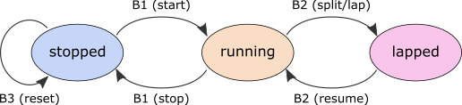

This program works as a stopwatch emulator for Arduino with an attached Funshield. It measures time with 0.1 s precision and displays it on a 4-digit 7-segment display. Three buttons are used to control the device according to this diagram:

Same as with the running message project, this was given to us as an assignment in the Computer Systems course. The `funshield.h` file was provided by the teachers, so only the `solution.ino` is my own work. 

If you cannot run this program on your own machine, see [this video](https://www.yout-ube.com/watch?v=wT15zxqQthM), which visualizes the reference solution, to get a better idea.